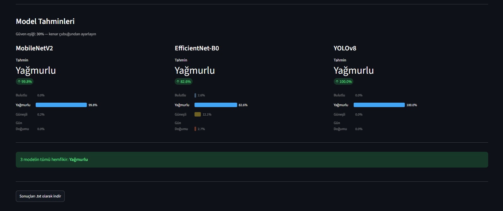

# 🌦️ Weather Classification with Deep Learning & XAI

A computer vision project for multi-class weather image classification using **MobileNetV2, EfficientNet-B0, and YOLOv8n-cls**, combined with **Grad-CAM** for explainable AI.

> This repository is a public project showcase.  
> The full source code, training notebooks, and trained model files are maintained privately.

---

## 🖥️ Application Preview

<p align="center">
  
</p>

---

## 📊 Model Predictions

<p align="center">
  
</p>

---

## 📌 Project Overview

The goal of this project is to classify weather images into four different categories:

- ☁️ **Cloudy**
- 🌧️ **Rain**
- ☀️ **Shine**
- 🌅 **Sunrise**

Three deep learning architectures were trained and evaluated:

- **MobileNetV2**
- **EfficientNet-B0**
- **YOLOv8n-cls**

The system compares the predictions and confidence scores produced by the different models.

The project also integrates **Grad-CAM (Gradient-weighted Class Activation Mapping)** to visualize which regions of an image influence the predictions of the neural networks.

---

## 🧠 Model Performance

| Model | Test Accuracy |
|---|---:|
| MobileNetV2 | 95.35% |
| EfficientNet-B0 | 94.77% |
| **YOLOv8n-cls** | **97.67%** |

### 🏆 Best Performing Model

**YOLOv8n-cls achieved the highest test accuracy with 97.67%.**

The comparison demonstrates the performance differences between multiple deep learning architectures for weather image classification.

---

## 🔍 Explainable AI with Grad-CAM

Deep learning models are often difficult to interpret because their internal decision-making process is not directly visible.

To improve transparency, this project integrates **Grad-CAM**.

Grad-CAM generates heatmaps that highlight the regions of an image that contributed most to a model's prediction.

This makes it possible to:

- Understand model attention
- Analyze prediction behavior
- Compare different architectures
- Detect incorrect attention patterns
- Improve model interpretability

---

## 🚀 Main Features

- Multi-class weather image classification
- Deep learning model comparison
- Transfer Learning
- MobileNetV2 classification
- EfficientNet-B0 classification
- YOLOv8 image classification
- Grad-CAM explainability
- Confidence score analysis
- Custom prediction threshold
- Interactive Streamlit interface
- Visual comparison of model predictions

---

## 📊 Dataset

The project uses approximately **1,125 weather images** divided into four classes:

```text
Cloudy
Rain
Shine
Sunrise
```

Dataset used:

**Multi-class Weather Dataset — Kaggle**

Dataset identifier:

```text
pratik2901/multiclass-weather-dataset
```

---

## 🏗️ System Workflow

```text
              Weather Image
                    │
                    ▼
          Image Preprocessing
                    │
        ┌───────────┼───────────┐
        │           │           │
        ▼           ▼           ▼
  MobileNetV2  EfficientNet   YOLOv8n-cls
        │           │           │
        ▼           ▼           ▼
   Prediction   Prediction   Prediction
        │           │           │
        └───────────┼───────────┘
                    │
                    ▼
           Model Comparison
                    │
                    ▼
          Confidence Scores
                    │
                    ▼
              Grad-CAM
                    │
                    ▼
          Streamlit Interface
```

---

## 🛠️ Technologies

| Category | Technologies |
|---|---|
| Programming Language | Python |
| Deep Learning | PyTorch |
| Computer Vision | Torchvision, OpenCV |
| Models | MobileNetV2, EfficientNet-B0, YOLOv8n-cls |
| YOLO Framework | Ultralytics |
| Explainable AI | Grad-CAM |
| Web Interface | Streamlit |
| Data Processing | NumPy |
| Visualization | Matplotlib |
| Model Evaluation | Scikit-learn |
| Development Environment | Jupyter Notebook |

---

## 🎯 Key Concepts

This project demonstrates practical experience with:

- Computer Vision
- Deep Learning
- Convolutional Neural Networks
- Transfer Learning
- Multi-Class Classification
- Model Evaluation
- Model Comparison
- Explainable Artificial Intelligence
- Grad-CAM
- Confidence Analysis
- Interactive AI Applications

---

## 🔮 Future Improvements

Possible future improvements include:

- Training with a larger weather dataset
- Adding additional weather classes
- Comparing Vision Transformer architectures
- Improving data augmentation
- Adding real-time camera classification
- Deploying the application online
- Exporting models to ONNX
- Improving explainability analysis
- Adding automated model evaluation reports

---

## 🔒 Source Code

This repository is intended as a **public portfolio showcase**.

The complete implementation is maintained privately, including:

- Training source code
- Jupyter notebooks
- Streamlit application source
- Model weights
- Training pipelines
- Evaluation scripts

This public repository focuses on demonstrating the project's architecture, results, technologies, and visual outputs.

---

## 👨‍💻 Author

**Mousab Ghadri**

Computer Vision & Deep Learning Project

⭐ If you found this project interesting, consider giving the repository a star.