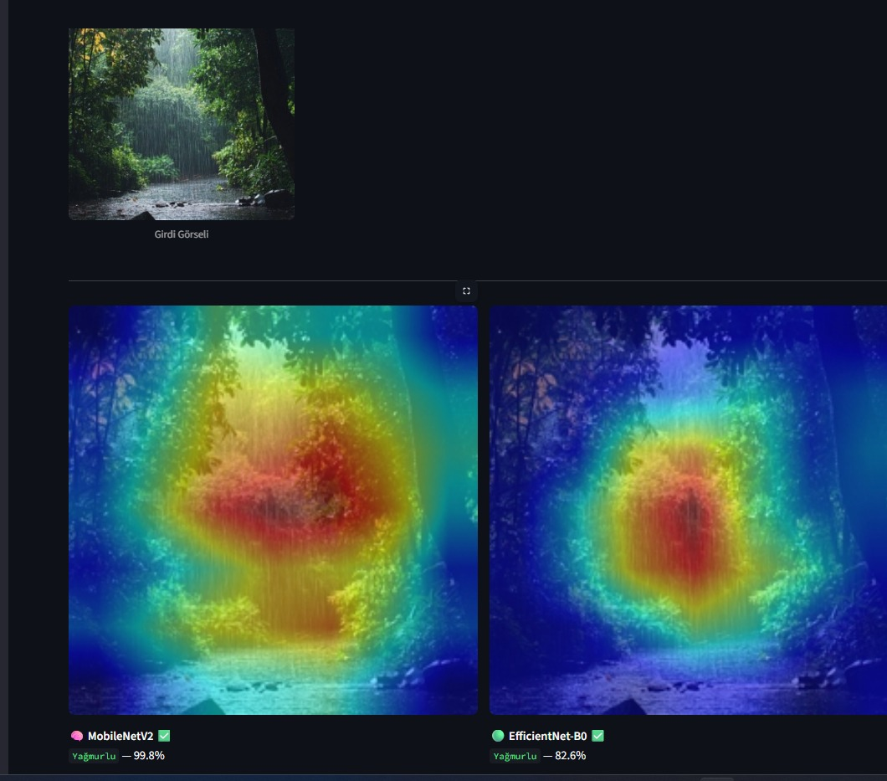

# 🌦️ Weather Classification with Deep Learning & XAI

A computer vision project for multi-class weather image classification using **MobileNetV2, EfficientNet-B0, and YOLOv8n-cls**, combined with **Grad-CAM** for explainable AI.

> This repository is a public project showcase.  
> The full source code, training notebooks, and trained model files are maintained privately.

---

## 🖥️ Application Preview

  

---

## 📌 Project Overview

The system classifies weather images into four categories:

- ☁️ **Cloudy**
- 🌧️ **Rain**
- ☀️ **Shine**
- 🌅 **Sunrise**

Three deep learning architectures were trained and evaluated:

- **MobileNetV2**
- **EfficientNet-B0**
- **YOLOv8n-cls**

The project also integrates **Grad-CAM** to visualize which image regions contribute most to model predictions.

---

## 🧠 Model Performance

| Model | Test Accuracy |
|---|---:|
| MobileNetV2 | 95.35% |
| EfficientNet-B0 | 94.77% |
| **YOLOv8n-cls** | **97.67%** |

🏆 **YOLOv8n-cls achieved the highest test accuracy at 97.67%.**

---

## 🔍 Explainable AI

Grad-CAM was used to visualize the regions of an image that influenced the prediction.

This helps analyze:

- Model attention
- Prediction behavior
- Differences between architectures
- Model interpretability

---

## 🚀 Main Features

- Multi-class image classification
- Transfer Learning
- MobileNetV2
- EfficientNet-B0
- YOLOv8 Classification
- Grad-CAM Explainability
- Confidence Score Analysis
- Model Comparison
- Interactive Streamlit Application

---

## 🛠️ Technologies

- Python
- PyTorch
- Torchvision
- Ultralytics YOLOv8
- OpenCV
- Grad-CAM
- Streamlit
- NumPy
- Matplotlib
- Scikit-learn

---

## 📊 Dataset

The project was trained using approximately **1,125 weather images** across four classes:

`Cloudy` · `Rain` · `Shine` · `Sunrise`

Dataset: **Multi-class Weather Dataset — Kaggle**

---

## 🔒 Source Code

This repository is intended as a public portfolio showcase.

The complete implementation, including:

- Training notebooks
- Application source code
- Model weights
- Training pipeline

is maintained in a private repository.

---

## 👨‍💻 Author

**Mousab Ghadri**

Computer Vision & Deep Learning Project